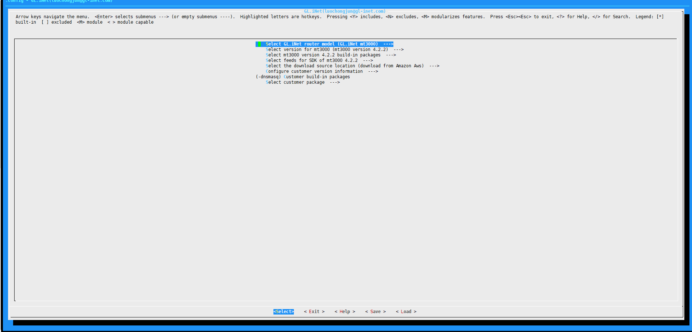

# glbuilder

## 简介
在这个项目之前，我在glinet的中文论坛有帖子教大家怎样基于[gl-infra-builder](https://github.com/gl-inet/gl-infra-builder)打包出带glinet页面的固件，不少用户喜欢，由于驱动部分使用到很多芯片厂商维护的驱动代码，我们无权开放给用户，尝试过以ko形式提供给用户，但总会遇到很多奇奇怪怪的问题，为此，我基于gl-infra-builder的产出物imagebuilder和SDK构建了glbuilder这个项目来解决当前的问题。

**glbuilder同样支持完整构建带glinet UI界面的固件，同时，还支持直接集成ipk文件和源码文件**，另外，为了便于更多的小白用户可以玩转编译，我还为项目配置了menuconfig图形界面和国内源。




## 安装编译环境
```
sudo apt update 
sudo apt install device-tree-compiler g++ ncurses-dev python asciidoc bash bc binutils bzip2 fastjar flex gawk gcc genisoimage gettext git intltool jikespg libgtk2.0-dev libncurses5-dev libssl-dev make mercurial patch perl-modules python2.7-dev rsync ruby sdcc subversion unzip util-linux wget xsltproc zlib1g-dev zlib1g-dev -y
```


## 编译支持GL UI的固件(基础配置)

1. 进入menuconfig界面进行配置
```
make menuconfig
```
2. 在Select GL.iNet router model选项中选择路由器型号。
3. 在Select version for mt3000选项中选择基于官方固件的版本做后续修改。
4. Select mt3000 version 4.2.2 build-in packages选项中可以选择glinet的内置包，新手建议保持默认，不做修改。
5. Select feeds for SDK of mt3000 4.2.2选项可以使能SDK的feeds，禁用无需使用feeds可以加快源码编译的速度，新手建议保持默认，不做修改。
6. Select the download source location选项可以选择imagebuilder和SDK镜像的下载源，大陆用户建议选择China Aliyun
7. 在Configure customer version information下面可以配置自己的版本号，版本类型，releasenotes等版本相关内容，可以自己根据实际情况修改
8. 以上配置完成后，暂不关注其他的配置选项，保存退出后执行
```
make
```
9. 等待编译完成后，编译好的镜像会在当前目录的bin/<model>/<version>/target目录下


## 加入自己的IPK

1. 如果是openwrt通用的ipk，glbuilder将自动从imagebuilder或gl的软件仓库自动查找安装，如果是非常见的ipk请将自己的ipk文件放置在项目根目录的customer/ipk/目录下
2. 根据自己的需求完成[基础配置](#编译支持gl-ui的固件基础配置)（不需要执行最后的make）
3. 在Customer build-in packages选项中加入IPK的名字，如luci-app-aria2; 如果要移除某个包可以在前面加上'-'符号，如-dnsmasq代表不需要安装dnsmasq。在项目board/<model>/<version>/version_info.mk中，有通过gl_collision_package预置一些移除的包，原因是这些包与glinet的预置包冲突，如果有必要，可以编辑修改对应的gl_collision_package变量。
4. 保存配置并退出，执行
```
make
```
5. 编译好的镜像位置与基础配置中的镜像位置一样


## 加入自己的源码文件

1. 将自己的源码文件克隆到项目根目录的customer/source目录下
2. 根据自己的需求完成[基础配置](#编译支持gl-ui的固件基础配置)（不需要执行最后的make）
3. 在Select customer package目录下选择自己需要编译到固件的包，此目录下的目录展开基于源码中的各个Makefile，与openwrt官方源码的展开方式一致。
4. 保存配置并退出，执行
```
make
```
5. 编译好的ipk文件在当前目录的bin/<model>/<version>/package目录下
5. 编译好的镜像位置与基础配置中的镜像位置一样


## TIPS
1. 源码和IPK形式的编译可以相互组合
2. Customer build-in packages 选项中使用'-'符号移除的包可能被其他依赖重新选择，需要把对应的依赖包同时移除
3. 出现问题时可以分步调试，目前常用的子命令有：
```
make sdk/download  #下载SDK镜像
make sdk/prepare #将SDK镜像解压并配置一些基础文件
make sdk/feeds/update #更新SDK的feeds
make sdk/compile #使用SDK编译源码形式的包
make sdk/install #将编译好的ipk拷贝到bin目录
make sdk/package/index #给编译好的ipk生成索引
make sdk/clean #清除所有SDK相关的编译环境

make customer/source/<path>/compile #编译customer/source/目录下的单个包
make customer/source/<path>/clean #清除customer/source/目录下指定包的编译环境及IPK文件
make customer/ipk/index #为cuntomer/ipk目录下的IPK文件生成索引

make imagebuilder/download #下载imagebuilder镜像
make imagebuilder/prepare #将imagebuilder镜像解压并配置一些基础文件
make imagebuilder/compile #打包固件
make imagebuilder/clean: #清除所有imagebuilder相关的编译环境

make menuconfig #进入配置菜单
make clean #删除构建目录及临时文件
make distclean #删除构建目录及临时文件，删除生成好的镜像文件和所有构建工具

```